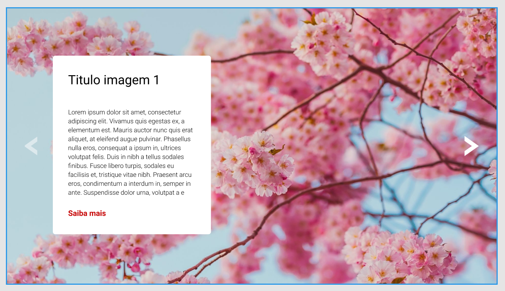
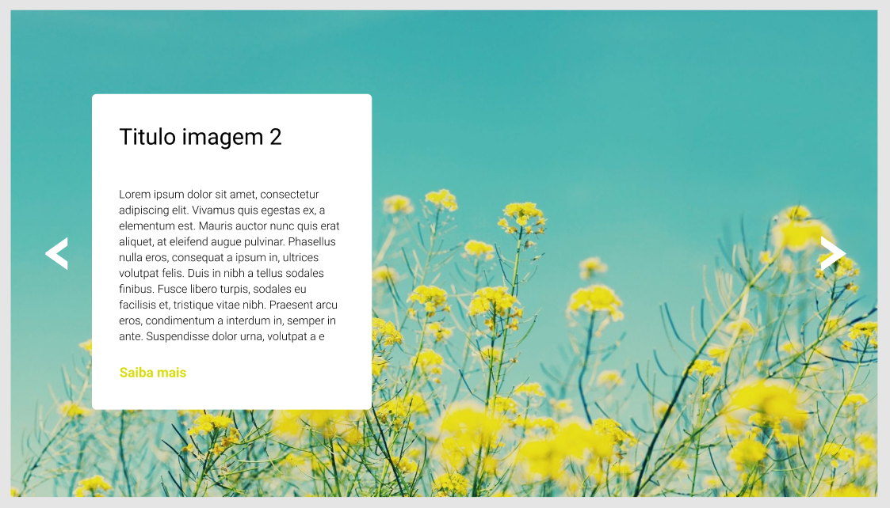
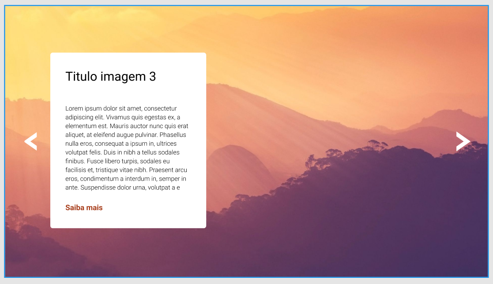
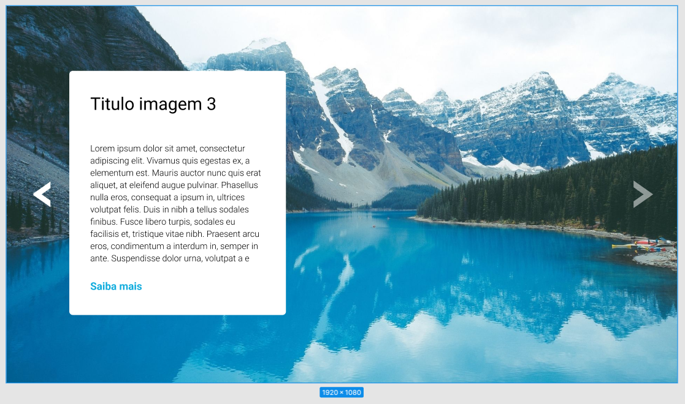

# Módulo Intermediário de JavaScript - Exercício 5

## Visão geral

### Exercício 
Crie um carrossel (slider) de imagens conforme layout do figma
Exercício 1

#### Pontos de atenção

- O slider possui uma seta a esquerda e outra a direita que servem pra passar ou voltar a imagem.
- Quando for a primeira imagem, a seta da esquerda deve ficar com uma opacidade e sem clique.
- Quando for a última imagem, a seta da direita deve ficar com uma opacidade e sem clique. 

**IMPORTANTE:** Esse site é um exercício do curso e ele não foi pensado em responsividade ou em ser postado, o que importa nele é a interação do JS e não o site em sí. Eu só achei ele legal e decidi postar, portanto essa "responsividade" feita foi só uma 'gambiarra' para o site poder funcionar em telas de celular também, dito isso fique a vontade para seguir em frente ^^.

## Preview 🎴


### Links 🔗

- Site: [Live Site](https://ramon-alvez.github.io/DevQuest-JS-Slider/)
- Repositório: [GitHub](https://github.com/Ramon-Alvez/DevQuest-JS-Slider)

### Figma 🎨









---

## Processo 🧱

### O que eu aprendi 📚

Estou muito feliz de ter conseguido chegar até o final, tive que superar um desafio após o outro em relação ao JavaScript, porém sinto que já consegui entender melhor como trabalhar com o DOM, criar eventListeners e um pouco de funções também. Verdade seja dita eu ainda estou longe de dominar tudo isso, mas já é um passo bem grande. 

Estou bem orgulhoso do código que escrevi, provavelmente tem uma forma de dar uma bela enxugada nele mas como foi o meu primeiro site com JS feito do 0 por mim mesmo eu quis deixar ele assim como está, para deixar registrado a minha solução, e a minha evolução. 

### Desafios 🏋️

Assim como eu falei aqui em cima foi um desafio após o outro:

me perdi um pouco na hora de criar a função que troca de slide. Mas eu superei isso criando um script de passo a passo e deixar ele comentado na minha cara para eu ter um "checklist" visual do que eu preciso fazer e do meu progresso, o script era: 

1. Reconhecer qual foi o botão do click
2. Verificar a posição atual e para que lado ir
3. Se for possível mudar de posição, incrementar
4. Se estiver no final do índice desativar o botão

Após fazer o script resolver a parte da função foi mais tranquilo, mas depois a parte que eu penei de verdade foi desativar o botão, no começo eu consegui fazer a trava mas como eu tinha colocado a função dentro do evento de clicar no botão ele era reconhecido depois do clique (meio obvio né, fui meio non-sense nessa parte aqui =p) resultando no botão esquerdo (que deveria começar desativado) ficasse ativado na hora. 

Depois eu criei o que seria a função atual:

``` JavaScript

function botaoInativo (posicaoAtual) {
    if (posicaoAtual == 0) listaBotoes[0].classList.add('botaoInativo')
    if (posicaoAtual == (cards.length - 1)) listaBotoes[1].classList.add('botaoInativo')
    else {
        for (let indice = 0; indice < listaBotoes.length; indice++) {
            if (listaBotoes[indice].classList.contains('botaoInativo')) listaBotoes[indice].classList.remove('botaoInativo')
        }
    }
    for (let indice = 0; indice < listaBotoes.length; indice++) {
        if (listaBotoes[indice].classList.contains('botaoInativo')) listaBotoes[indice].disabled = true
        else listaBotoes[indice].disabled = false
    }
}


```

Ela até que funcionava bem, mas novamente o primeiro botão não desativava, eu achei que fosse algum erro de lógica na condição (posicaoAtual == 0), na minha cabeça eu ficava "se 0 == 0 por que isso está dando errado ?" acontece que na minha lógica o programa estava sendo percorrido desta forma: 

1. Posição atual é igual a 0 ? -> botão 0 fica inativo; 
2. Posição atual é igual a 3 ? -> botão 1 fica inativo; 
3. Se não é 0 nem 3, então ele está entre 0 e 3 -> Executa a verificação se existe o anulador de botão, se existir remove a classe.

Porém de alguma forma que eu não sei dizer bem o porque, ele entrava na primeira condição e no else também, então o else anulava a minha classe 'botaoInativo' e isso fazia o botão continuar ativo. 

Por isso tive que trocar o else por outra condição, transformando ele na função atual: 
``` JavaScript

function botaoInativo (posicaoAtual) {
    if (posicaoAtual == 0) listaBotoes[0].classList.add('botaoInativo')
    if (posicaoAtual == (cards.length - 1)) listaBotoes[1].classList.add('botaoInativo')
    if ((posicaoAtual > 0) && (posicaoAtual < (cards.length - 1))) {
        for (let indice = 0; indice < listaBotoes.length; indice++) {
            if (listaBotoes[indice].classList.contains('botaoInativo')) listaBotoes[indice].classList.remove('botaoInativo')
        }
    }
    for (let indice = 0; indice < listaBotoes.length; indice++) {
        if (listaBotoes[indice].classList.contains('botaoInativo')) listaBotoes[indice].disabled = true
        else listaBotoes[indice].disabled = false
    }
}

```

Eu deixei o cards.length - 1 na condicional porque embora possa ser complicação da minha parte, eu achei que fosse melhor assim pois 'em uma situação hipotética onde esse slider fosse receber mais slides no futuro eu não precisaria me preocupar em mexer nessa função manualmente', assim ele busca o tamanho do índice sozinho.

---

### Atualização - 06/11/2024

Não mexi em nada do código, mas assistindo o vídeo da resolução do exercício e olhando meu código, eu percebi uma redundância nos botões '< >', eu criei uma outra variável contendo uma lista de botões mas na verdade eu não precisava fazer isso pois eu já possuia esses elementos armazenados nas variáveis botão direito e botão esquerdo.

Também tive mais ideias de como deixar esse algoritmo mais simples, em breve eu vou passar aqui e tentar deixar esse código mais otimizado.

### Desenvolvimento contínuo 🚀

Bom, já finalizei o módulo intermediário de JS e falta mais um exercício (e uma quest) para passar para o avançado, estou muito animado para "debulhar" essa linguagem e me virar um bom desenvolvedor (e consequentemente arranjar um emprego 😅)

Meu próximos passos serão finalizar o módulo de Desenvolvimento Frontend e ir para o Frontend Mentor por a mão na massa e fixar ainda mais o conhecimento na minha cabeça. 

## Autor 🧙‍♂️

- GitHub - [Ramon Alvez](https://github.com/Ramon-Alvez)
- LinkedIn - [@Ramon Alvez](https://www.frontendmentor.io/profile/Ramon-Alvez)